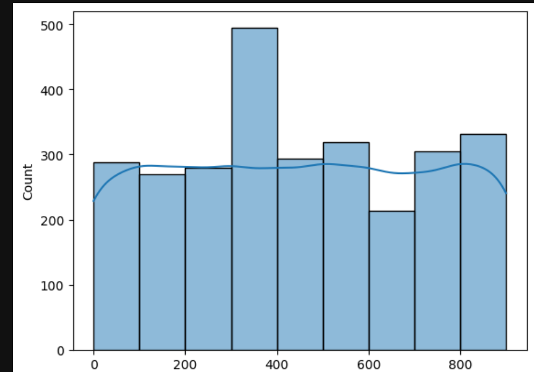

# Credit Score Analysis Report

## 📊 Score Distribution

We analyzed credit scores for DeFi user wallets using Aave V2 transaction data. The scores were grouped into buckets with intervals of 100. Here is the distribution:

| Score Range | Number of Wallets |
|-------------|-------------------|
| 0–100       | 288                 |
| 101–200     | 270                 |
| 201–300     | 280                 |
| 301–400     | 479                 |
| 401–500     | 308                 |
| 501–600     | 321                 |
| 601–700     | 215                 |
| 701–800     | 307                 |
| 801–900     | 329                 |

Here is the histogram representation of the same:

---

## 🧠 Interpretation in Simple Terms

We created a credit score (0–1000) for users based on how they interact with Aave V2 on the Polygon network. The higher the score, the more responsible and active the wallet appears.

### 🟥 Low Score Wallets (0–300)

- Tend to make fewer or smaller deposits.
- Have high loan-to-value (LTV) ratios, meaning they borrow a lot compared to what they deposit.
- May show irregular activity (e.g., borrowing a lot and quickly repaying).
- Might be new users or wallets that are less engaged.

**Layman Example**: These users are like someone who takes a lot of loans and keeps very little money in their bank. They might be risky to lend to.

---

### 🟨 Mid Score Wallets (301–700)

- Have decent deposit and borrow behavior.
- May have steady activity over time.
- Might repay loans in a consistent manner.
- Could improve scores with more deposits or lower LTV.

**Layman Example**: These are average customers. They sometimes take loans, sometimes repay on time. Not risky but not the best either.

---

### 🟩 High Score Wallets (701–1000)

- Frequently deposit large amounts and maintain a healthy balance.
- Borrow responsibly — they don’t max out their borrowing capacity.
- Repay loans regularly and don’t default.
- Show stable, long-term activity.

**Layman Example**: These are ideal bank customers. They save a lot, take loans only when needed, and repay on time. Banks love these users.

---

## ✅ Insights Summary

- **Most wallets fall in the mid-score range (301–700)**, indicating average usage behavior.
- **High-score wallets are fewer** but show stable, consistent financial behavior.
- **Low-score wallets** may indicate users with either risky borrowing or very low engagement.

These insights can help in risk assessment, credit extension decisions, or identifying power users for rewards.

---

